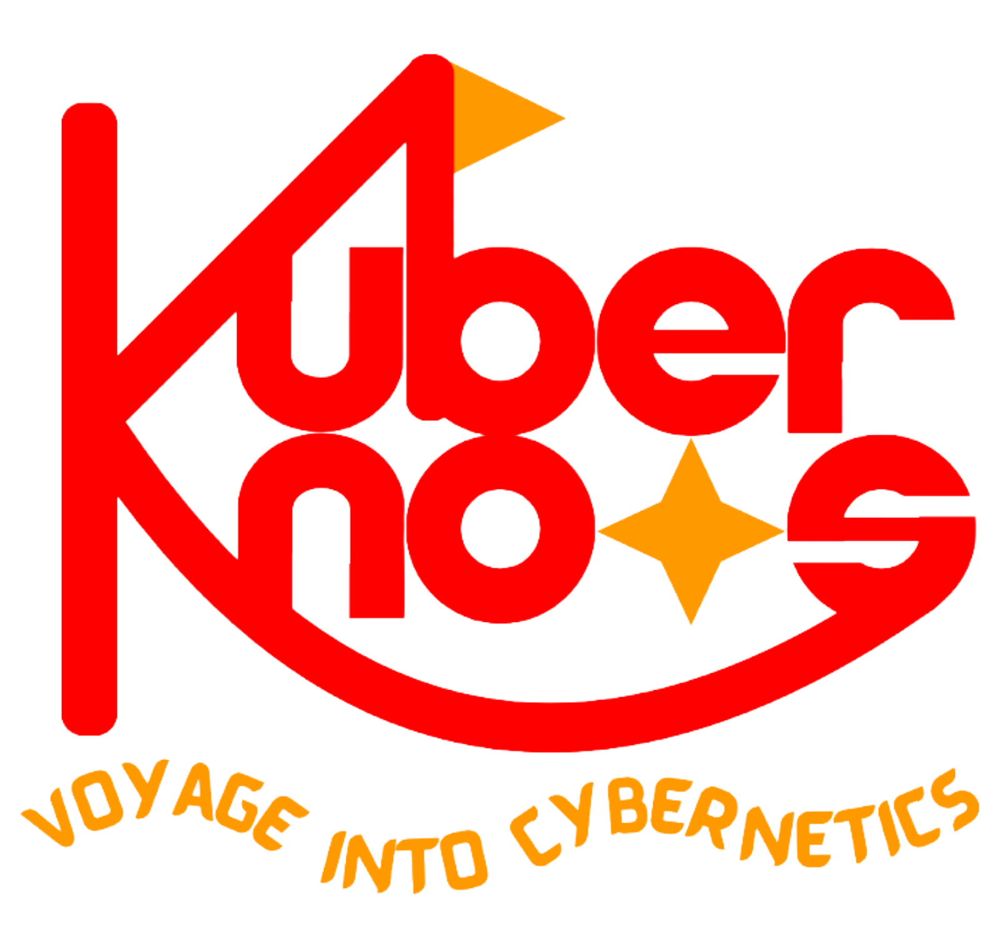

```{=html}
<div class="site-page engagements-page">

<section class="site-intro">
  <div class="site-kicker">Events · Presentations · Public engagement</div>
  <h2>Engagements</h2>
  <div class="site-lede">
    <p>In this page, you can find my engagement in various formats, such as presentations, workshops, conferences, podcasts, and other outreach activities beyond formal research outputs.</p>
  </div>
</section>

<section class="site-section" id="features">
  <div class="engagement-section-heading">
    <div>
      <div class="engagement-section-kicker">Ongoing</div>
      <h2 class="site-section-title">Current projects</h2>
    </div>
  </div>

  <article class="engagement-feature-card">
    <div class="engagement-feature-visual engagement-feature-podcast">
    	<!--
      <div class="podcast-wave">
        <span></span><span></span><span></span><span></span><span></span><span></span><span></span>
      </div>
      -->
      <a class="podcast-logo-link" href="https://kuberknots.com" aria-label="Visit the Kuberknots podcast website">
				<div class="podcast-mic">
					
				</div>
			</a>
    </div>

    <div class="engagement-feature-body">
      <div class="engagement-card-meta">Podcast</div>
      <a href="https://kuberknots.com"><h3>Kuberknots | Voyage into Cybernetics<span class="external-arrow" aria-hidden="true">↗</span></h3></a>
      <p>
        I am hosting a podcast exploring complexity, cybernetics, technology, and the ideas that connect research with broader cultural and public questions. Through conversations with guests from diverse backgrounds, I aim to unpack the technical and philosophical dimensions of these fields in plain language and make them accessible beyond disciplinary boundaries.
      </p>
      <div class="engagement-tags">
        <span>Complexity</span>
        <span>Cybernetics</span>
        <span>Humanity</span>
        <span>Technology</span>
        <span>Society</span>
      </div>
      <!--
      <div class="engagement-feature-actions">
        <a class="engagement-primary-link" href="https://kuberknots.com">Listen to the podcast →</a>
      </div>
      -->
    </div>
  </article>
</section>

<section class="site-section site-band" id="activities-section">
  <div class="engagement-section-heading">
    <div>
      <div class="engagement-section-kicker">Selected engagements</div>
      <h2 class="site-section-title">Events & Contributions</h2>
    </div>
  </div>

	<!-- Event cards listed here -->
  <div id="activities"></div>
</section>

</div>
```
