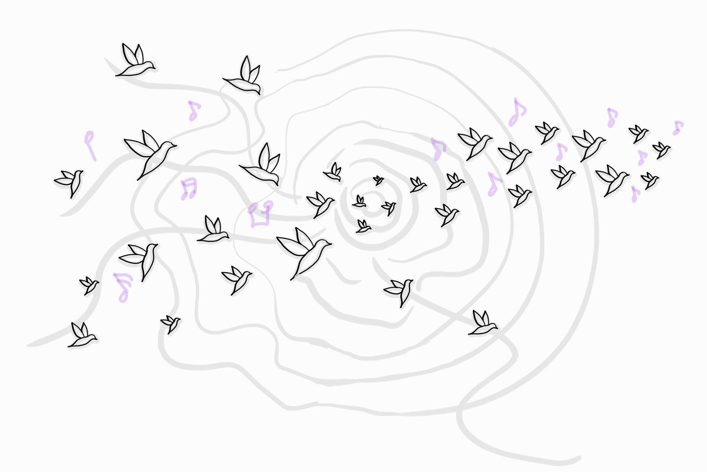

```{=html}


<div class="research-page">

<section class="research-intro">
  <div class="research-kicker">Complexity · Information · Topology</div>
  <h2>Research</h2>
  <div class="research-lede">
  	<p class="research-muted">
  		We are living in a vast ocean of data. As cognitive beings, we continually seek to derive meaning from the information we encounter — identifying patterns, forming abstractions, and constructing narratives that help us navigate an increasingly complex world.
  	</p>
    <p>
      My research asks a simple yet far-reaching question: <b>how do coherent structures emerge from many interacting components without central control?</b> From material organisation and communication networks to embodied human experience, I investigate how local interactions give rise to collective patterns, adaptive behaviours, and shared meaning.
    </p>
    <p>
      Beginning with my PhD work on <b>geometry-driven hyperuniformity</b>, I became interested in how remarkably simple generative rules can produce striking forms of collective order. More recently, I have extended this perspective to <b>information systems mediated by generative AI</b>, where feedback, adaptation, and communication continually reshape how knowledge is created, circulated, and transformed. Alongside these computational studies, I am exploring <b>embodied complexity</b> through interactive experiences, such as <i>Musical Allostasis</i>, which invites participants to experience self-organisation and collective dynamics through collaborative music-making, with feedback and feedforward anticipation shaping how the group adapts over time.
    </p>
    <p>
    	Across these domains, I combine ideas from complexity science, cybernetics, and topology to uncover organisational principles that transcend individual systems. Rather than studying any single application in isolation, I seek recurring structures and mechanisms that reveal how complex systems organise, adapt, and remain resilient across diverse domains.
    </p>
  </div>
</section>

<section class="research-band">
  <div class="research-section">
    <h2 class="research-section-title">Research themes</h2>
    <p>
    	Click on each research theme below to find more details.
    </p>
    <div class="research-grid">
      <a class="research-card" href="research/hyperuniformity.html" aria-label="Order, Disorder and In-between">
        
        <div class="research-card-body">
          <h3>Order, Disorder and In-between</h3>
          <p>How simple local interactions generate spatial organisation and reveal universal principles of pattern formation.</p>
        </div>
      </a>

      <a class="research-card" href="research/information-dynamics.html" aria-label="Information Dynamics">
        
        <div class="research-card-body">
          <h3>Information Dynamics</h3>
          <p>How information, meaning, and knowledge evolve through communication, feedback, and human–AI interaction.</p>
        </div>
      </a>

      <a class="research-card" href="research/embodied-complexity.html" aria-label="Embodied Complexity">
        
        <div class="research-card-body">
          <h3>Embodied Complexity</h3>
          <p>How self-organisation, adaptation, and collective behaviour can be experienced through interactive systems and creative media.</p>
        </div>
      </a>


<!--
      <article class="research-card">
        
        <div class="research-card-body">
          <h3>Knowledge integrity & structural diagnostics</h3>
          <p>Topological and structural methods for diagnosing coherence, robustness, distortion, and integrity in knowledge systems.</p>
          <a href="research/knowledge-integrity.html">Read more →</a>
        </div>
      </article>
-->
    </div>
  </div>
</section>


<!--
<section class="research-intro">
	<h3 class="research-section-title">Research methodologies</h3>
  <h4>Topological analysis</h4>
  <div class="research-lede">
		<p>
			One of the central challenges in studying complex systems is that their most important structures are often hidden within high-dimensional data. Rather than focusing on individual observations, topological data analysis (TDA) seeks to understand the shape of data, i.e., the patterns of connectivity, clusters, loops, and higher-dimensional relationships that persist across scales.
		</p>
		<p>
			A key tool in TDA is persistent homology, which tracks how these topological features appear and disappear as we progressively change our notion of proximity. Features that persist across many scales are often indicative of meaningful structure, while short-lived features may correspond to noise.
		</p>
		<p>
		The interactive demonstration below illustrates this process by growing balls around a collection of points and computing the resulting persistent homology, allowing you to explore how topological signatures emerge from seemingly simple data.
		</p>
		<a class="demo-button" href="/interactive/persistence/">Launch interactive demo →</a>
	</div>
</section>
-->


</div>
```
